# 🧬 Excel-8

## ✨ Project Description

**Excel-8** is a guide to working with text in Microsoft Excel. Explore practical tips, instructions, and illustrations for manipulating text strings using functions like LEFT, RIGHT, MID, LEN, FIND, SUBSTITUTE, TRIM, Text To Columns, SEARCH, UPPER, LOWER, PROPER, EXACT, TEXT, CONCATENATE, TEXTJOIN, TEXTBEFORE, TEXTAFTER, and more.

> 📚 **Goal:** Help you master text operations in Excel—suitable for both beginners and advanced users!

> 🔗 **Note:** Many operations on text can be performed using Flash Fill described in [Excel-1 repository](https://github.com/Kuba27x/Excel-1).

---

## 📒 Table of Contents

- [Join Strings](#-join-strings)
- [LEFT](#-left)
- [RIGHT](#-right)
- [MID](#-mid)
- [LEN](#-len)
- [FIND & SEARCH](#-find--search)
- [SUBSTITUTE & REPLACE](#-substitute--replace)
- [TRIM & Counting Words](#-trim--counting-words)
- [Text to Columns](#-text-to-columns)
- [Change Case](#-change-case)
- [Compare Text](#-compare-text)
- [TEXT Function](#-text-function)
- [TEXTJOIN, TEXTBEFORE, TEXTAFTER](#-textjoin-textbefore-textafter)
- [Screenshots](#-screenshots)
- [Requirements](#-requirements)
- [Author](#-author)

---

## ➕ Join Strings

To join strings, use the `&` operator.

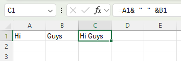

Alternatively, use the `CONCATENATE` function.

---

## 🔡 LEFT

Extract the leftmost characters from a string:

---

## 🔢 RIGHT

Extract the rightmost characters from a string:

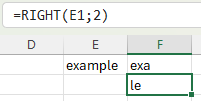

---

## 🎯 MID

Extract a substring starting from the middle of a string:

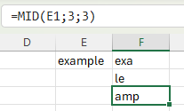

---

## 🔠 LEN

Get the length of a string:

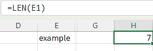

---

## 🔍 FIND & SEARCH

Find the position of a substring:

- `FIND` (case-sensitive)
- `SEARCH` (case-insensitive, supports wildcards)

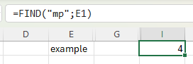

---

## 🔁 SUBSTITUTE & REPLACE

Replace existing text in a string:

- `SUBSTITUTE` replaces occurrences of text.
- `REPLACE` is useful when you know the position.

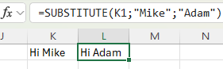

---

## 🧹 TRIM & Counting Words

- `TRIM` returns a string with only regular spaces.

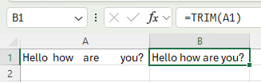

- To get the length of the string without spaces:

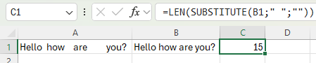

- To count the number of words:

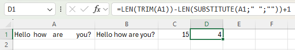

> ℹ️ **Tip:** Count the spaces in a cell and add 1 to get the total number of words.

---

## ✂️ Text to Columns

1. Select the range with full names.
2. On the Data tab, in the Data Tools group, click **Text to Columns**.
3. Choose **Delimited** and click **Next**.

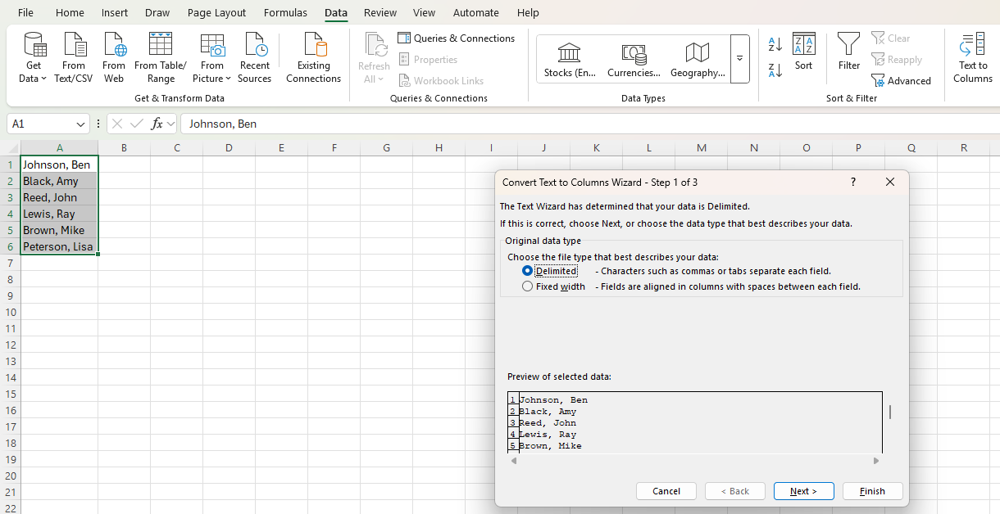

4. Clear all checkboxes except for Comma and Space.

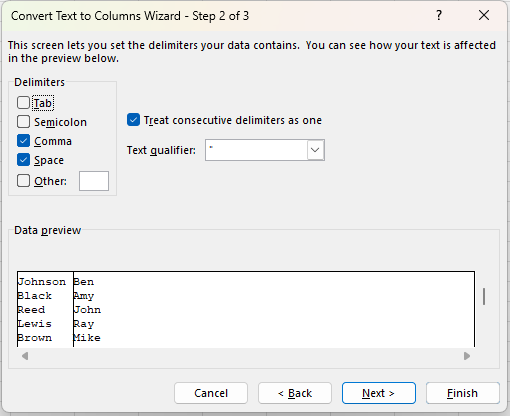

5. Click **Finish**.

**Result:**

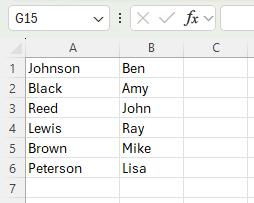

---

## ↕️ Change Case

- Use `UPPER` to change text to uppercase:

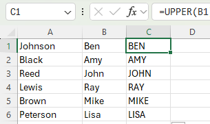

- Use `LOWER` for lowercase.
- Use `PROPER` for capitalizing the first letter of each word:

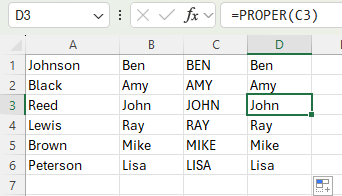

---

## 🆚 Compare Text

- Use `EXACT` for case-sensitive comparison:

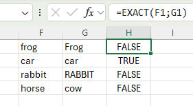

- Use `=F1=G1` for case-insensitive comparison:

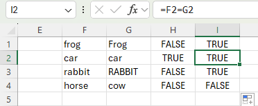

---

## 🧾 TEXT Function

Format numbers when joining text and numbers:

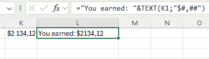

> `#,##` adds commas to large numbers.

---

## 🔗 TEXTJOIN, TEXTBEFORE, TEXTAFTER

- `TEXTJOIN` (Excel 2016+) joins a range of strings using a delimiter, can ignore empty cells.

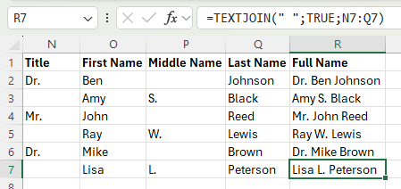

- In Excel 365, use `TEXTBEFORE` or `TEXTAFTER` to extract substrings:

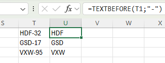
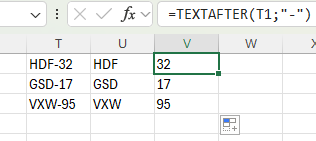

---

## 📷 Screenshots

Find all screenshots in the `/Screenshots` folder.

---

## ℹ️ Requirements

- Microsoft Excel (recommended: 2016/2021/365 for modern functions)
- Windows OS for full functionality

---

## 👨‍💻 Author

Project and documentation by **Kuba27x**  
Repository: [Kuba27x/Excel-8](https://github.com/Kuba27x/Excel-8)

---
